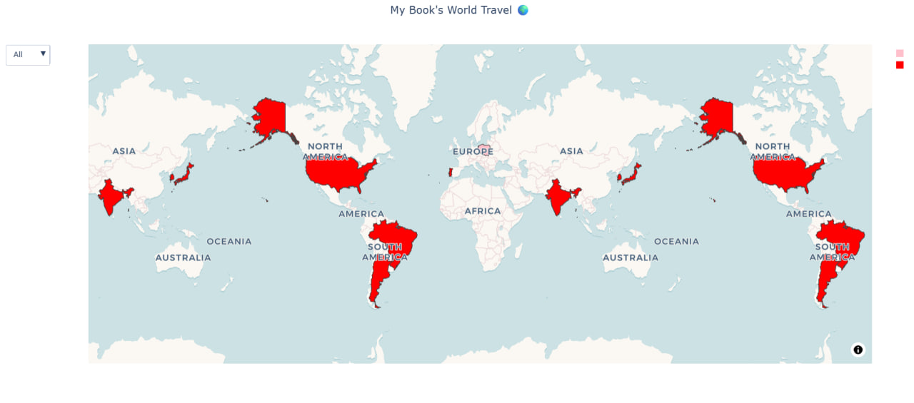

# My Book Map 📚🌍

An interactive map of the books I have read, built with Python.

## Map

The map shows the countries represented in my reading data and allows the books to be explored by reading year using a dropdown menu.

## Data Source

The book  data was organized from [My Maratona App Profile](https://maratona.social/@lidialecle).
